<div align="center">


<a href="https://github.com/nimanazari">
  
</a>

<br/>


<a href="https://github.com/nimanazari?tab=followers"></a>
<a href="https://github.com/nimanazari?tab=repositories"></a>

</div>

<br/>

## About Me

```python
class Nima:
    def __init__(self):
        self.name     = "Nima Nazari"
        self.role     = "Developer & Maker"
        self.focus    = ["Robotics", "Smart Home", "Game Dev", "Automation"]
        self.stack    = ["Python", "JavaScript", "IoT"]
        self.fun_fact = "I make vacuum robots compete in a league"

    def say_hi(self):
        print("Thanks for dropping by! Let's build something cool.")

Nima().say_hi()
```

<br/>

## Tech Stack

<div align="center">


</div>

<br/>

## GitHub Stats

<div align="center">




<br/><br/>


<br/><br/>



<br/><br/>

<a href="https://github.com/nimanazari"></a>

</div>

<br/>

## Contribution Snake

<div align="center">

<picture>
  <source media="(prefers-color-scheme: dark)" srcset="https://raw.githubusercontent.com/nimanazari/nimanazari/output/github-snake-dark.svg"/>
  <source media="(prefers-color-scheme: light)" srcset="https://raw.githubusercontent.com/nimanazari/nimanazari/output/github-snake.svg"/>
  
</picture>

</div>

<br/>

## Featured Projects

<div align="center">

<a href="https://github.com/nimanazari/smarthome-vacuumleague"></a>
<a href="https://github.com/nimanazari/smarthome-teams"></a>

</div>

<br/>

## Connect

<div align="center">

<a href="https://github.com/nimanazari"></a>
<a href="mailto:nima.nazari93@gmail.com"></a>

<br/><br/>


</div>


